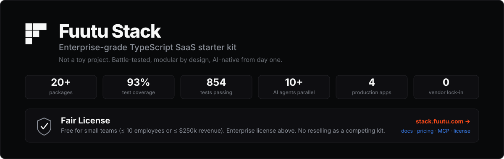
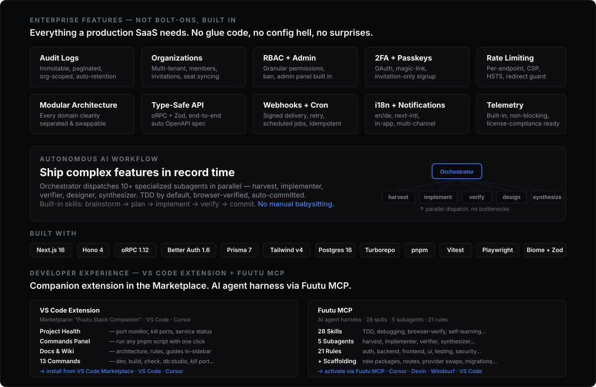

<p align="center">
  
</p>

<p align="center">
  
</p>

<p align="center">
  <a href="https://discord.gg/fF7fgQ7jZ3">💬 Discord</a> · <a href="https://stack.fuutu.com">📄 Docs</a> · <a href="https://github.com/Fuutu-company/fuutu-stack/issues">🐛 Issues</a> · <a href="./LICENSE.md">⚖ License</a>
</p>

---

## Quick Start

```bash
git clone https://github.com/Fuutu-company/fuutu-stack my-saas
cd my-saas
pnpm install
cp .env.example .env
pnpm db:start        # Postgres + MinIO via docker-compose
pnpm db:push         # push schema
pnpm db:seed         # optional: seed admin@fuutu.local / DevPassword!2345
pnpm dev             # saas :3000 · marketing :3001 · docs :4000
```

---

## What is Fuutu Stack?

A **production-grade TypeScript SaaS starter kit** — not a toy project. Next.js 16, Hono, oRPC, Better Auth, Prisma, TailwindCSS v4. Every domain (mail, payments, storage, analytics, AI) is behind a provider interface with one active implementation and skeletons for the rest. Swap Plunk for Resend, Polar for Stripe, S3 for Cloudflare R2 — without touching business logic.

**AI-native**: built-in MCP (Model Context Protocol) integration so LLM agents can discover and operate your project. AI provider-swappable (Google / OpenAI / Anthropic / Noop).

---

## Features

### Authentication & Security
- **Email/Password** with password policy + validation
- **Magic-Link** sign-in
- **OAuth** social login
- **2FA** (TOTP) + **Passkeys** (WebAuthn)
- **Organizations** — multi-tenant, members, invitations, seat syncing
- **RBAC** — granular role-based access control
- **Admin panel** — user management, ban, admin override
- **Invitation-only signup** — gate registration by domain or allowlist
- **Rate limiting** — per-endpoint, configurable
- **CSP** + **HSTS** + **open-redirect guard**
- **Audit logs** — immutable, paginated, org-scoped, auto-retention

### API & Backend
- **Hono 4** server (mounted at `/api/[[...rest]]`)
- **oRPC 1.12** — end-to-end type-safe API with auto-OpenAPI spec
- **Zod** validation on every input
- **API keys** — generate, revoke, scoped access
- **Webhooks** — signed delivery, retry with backoff, idempotent
- **Cron jobs** — audit-log cleanup, subscription reminders, telemetry ping, webhook retry

### Database & ORM
- **Prisma 7** on PostgreSQL 16
- Split `auth` + `app` schemas
- Generated Zod schemas from Prisma types
- ORM-agnostic export — queries isolated in `@fuutu/db`

### Frontend & UI
- **Next.js 16** (App Router, React 19, Turbopack)
- **TailwindCSS v4** with OKLCH theme
- **shadcn/ui** — framework-agnostic shared components (`@fuutu/ui`)
- **next-intl 4** — `en` + `de`, 100% translation policy
- **MediaFrame** — locale-aware images, CSP-safe

### Provider-Swappable Architecture
Every domain behind an interface — swap providers without touching business logic:

| Domain | Interface | Active | Skeletons |
|---|---|---|---|
| **Mail** | `MailProvider` | Plunk | Resend, SendGrid, Mailgun… |
| **Payments** | `PaymentProvider` | Polar | Stripe, Paddle, LemonSqueezy… |
| **Storage** | `StorageProvider` | S3 + MinIO | Cloudflare R2, Azure Blob… |
| **Analytics** | `AnalyticsProvider` | Umami | Plausible, PostHog, GA… |
| **AI** | `AIProvider` | Google | OpenAI, Anthropic, Noop… |
| **Search** | `SearchProvider` | — | MeiliSearch, Typesense, Algolia… |
| **Content** | `ContentProvider` | — | MDX, CMS, headless… |

### AI-Native
- **AI provider-swappable** — Google / OpenAI / Anthropic / Noop
- **Chat module** — conversations, messages, streaming
- **MCP-ready** — Model Context Protocol integration for LLM agents
- **AI agent harness** via Fuutu MCP (see Developer Experience below)

### App Modules (SaaS)
- **Dashboard** — overview, activity feed
- **Chat** — AI conversations with streaming
- **CRM** — contacts, pipeline
- **Notifications** — in-app, multi-channel
- **Organizations** — team management, invitations
- **Onboarding** — guided setup flow
- **Settings** — profile, API keys, billing
- **Admin** — audit logs, user management
- **Billing** — plans, subscriptions, invoices

### Infrastructure
- **Turborepo** + pnpm workspaces (version-catalog)
- **Biome** — format + lint (replaces ESLint + Prettier)
- **Vitest** — unit + integration tests (854+ passing, 93% coverage)
- **Playwright** — E2E tests (saas + marketing)
- **Telemetry** — build-time + runtime, non-blocking
- **License compliance** — 5 fingerprint emission points, kit integrity
- **Logging** — `createLogger({ scope })` with provider interface

---

## Architecture

```
fuutu-stack/
├── apps/
│   ├── saas/             # authed app + API (port 3000)
│   ├── marketing/        # public site (port 3001)
│   ├── docs/             # documentation (port 4000)
│   └── mail-preview/     # mail template preview (dev only)
├── packages/
│   ├── ai/               # AI provider-swappable (Google/OpenAI/Anthropic/Noop)
│   ├── analytics/        # AnalyticsProvider interface + Umami
│   ├── api/              # oRPC routers + Hono server
│   ├── auth/             # Better Auth (server + client)
│   ├── config/           # cross-cutting config + theme.css
│   ├── content/          # ContentProvider interface + active provider
│   ├── cron/             # scheduled jobs (audit cleanup, reminders, telemetry)
│   ├── db/               # Prisma client + queries (ORM-agnostic export)
│   ├── env/              # environment validation (@t3-oss/env-nextjs)
│   ├── i18n/             # next-intl utilities + i18nConfig
│   ├── license/          # checkLicense(), getLicenseMode() — compliance
│   ├── logs/             # createLogger({ scope }) + provider interface
│   ├── mail/             # MailProvider interface + templates
│   ├── notifications/    # in-app + multi-channel notifications
│   ├── payments/         # PaymentProvider interface + Polar
│   ├── rbac/             # role-based access control
│   ├── search/           # SearchProvider interface
│   ├── storage/          # StorageProvider interface + S3/MinIO
│   ├── telemetry/        # build-time + runtime telemetry helpers
│   ├── test-utils/       # shared test fixtures + helpers
│   ├── ui/               # shared UI components (framework-agnostic)
│   ├── utils/            # cn, getSafeRedirect, slugify, hash, invariant
│   └── webhooks/         # signed delivery, retry, idempotent
├── tooling/
│   ├── typescript/       # shared tsconfigs (base / nextjs / react-library)
│   └── tailwind/         # shared Tailwind preset + theme.css
```

Detailed architecture: **[stack.fuutu.com/docs/architecture](https://stack.fuutu.com/docs/architecture)**

---

## MCP Integration

Fuutu publishes a separate MCP (Model Context Protocol) server that lets LLM agents — Claude Desktop, Cursor, Windsurf — discover Fuutu-Stack projects and call managed tools against them.

This repository contains the **integration point** for that server. No MCP runtime is bundled. To enable:

1. Copy `fuutu.config.example.ts` to `fuutu.config.ts` in the repo root
2. Fill in `projectId` (issued at [stack.fuutu.com](https://stack.fuutu.com))
3. Point your MCP-aware editor at the Fuutu MCP server

`fuutu.config.ts` is gitignored by default — keep it local unless you want every developer to share the same `projectId`.

---

## Developer Experience — Extension + MCP

### VS Code Extension

**"Fuutu Stack Companion"** — available in the VS Code Marketplace. Works in VS Code and Cursor.

- **Project Health** — port monitor, kill ports, service status at a glance
- **Commands Panel** — run any pnpm script with one click
- **Docs & Wiki** — architecture, rules, and guides in-sidebar
- **13 commands** — dev, build, check, check-types, db:studio, kill port, open config…
- **Infisical support** — prefix commands with `infisical run --` for secret injection

### Fuutu MCP

The AI agent harness — 28 skills, 5 subagents, 21 rules — is delivered via the **Fuutu MCP server**, not bundled in this repo. Point your MCP-aware editor (Cursor, Devin, Windsurf, VS Code) at the Fuutu MCP server and the full harness activates. The MCP exposes **tool calls** — deterministic functions the LLM can invoke (scaffold, swap provider, check compliance) instead of guessing code from context.

| Layer | Count | What it does |
|---|---|---|
| **Skills** | 28 | TDD, brainstorming, systematic-debugging, browser-verification, self-learning, commit-proposal, codebase-graph, review… — auto-invoked based on task context |
| **Subagents** | 5 | `harvest` (scan/grep/read) · `implementer` (code/TDD) · `verifier` (run/parse) · `synthesizer` (cross-ref) · `designer` (architecture) — cost-tiered, parallel dispatch |
| **Rules** | 21 | global, auth, backend, frontend, ui, testing, security, i18n, rbac, logging, license, review… — enforced, not suggestions |
| **Multi-host** | 4 editors | Cursor · Devin · Windsurf · VS Code |

Beyond the agent harness, the MCP server also provides:

- **Project Scaffolding** — "add a new package", "create a route with auth guard", "scaffold a new module" — generates code that follows Fuutu conventions by default
- **Provider Swaps** — "swap Plunk for Resend", "switch Polar to Stripe" — generates the active implementation from the provider interface
- **Versioning API** — Kit updates, breaking-change alerts, auto-migration suggestions when a new Fuutu Stack version drops
- **Compliance Check** — verifies all 5 fingerprint emission points, license validity, telemetry setup
- **Smart Debugging** — send errors to the MCP, it knows the Fuutu codebase structure and can pinpoint root causes

**Default workflow:** `brainstorm → plan → implement (TDD) → verify → browser-check → commit`. The orchestrator dispatches subagents in parallel, each with the cheapest capable cost tier.

---

## Scripts

```bash
pnpm dev                   # all apps in parallel
pnpm dev:saas              # saas only
pnpm dev:marketing         # marketing only
pnpm build                 # build everything
pnpm check                 # biome format + lint --write
pnpm check-types           # tsc --noEmit across workspaces
pnpm db:push / :migrate / :studio / :seed / :start / :stop
pnpm test                  # vitest (unit/integration)
pnpm test:e2e              # Playwright (saas + marketing)
```

---

## License

**Free for teams up to 10 employees or $250k annual revenue.** Above that, you need an Enterprise License.

| Tier | Price | Who |
|---|---|---|
| **OSS** | Free | ≤ 10 employees AND ≤ $250k revenue |
| **MCP Subscription** | Monthly | Anyone who wants MCP + versioning API |
| **Enterprise** | Yearly | Above either OSS threshold |

Full terms: **[LICENSE.md](./LICENSE.md)** · Pricing: **[stack.fuutu.com/pricing](https://stack.fuutu.com/pricing)**

---

## Links

- **Documentation**: [stack.fuutu.com/docs](https://stack.fuutu.com/docs)
- **Pricing**: [stack.fuutu.com/pricing](https://stack.fuutu.com/pricing)
- **Support**: [stack.fuutu.com](https://stack.fuutu.com)
- **License**: [LICENSE.md](./LICENSE.md)
